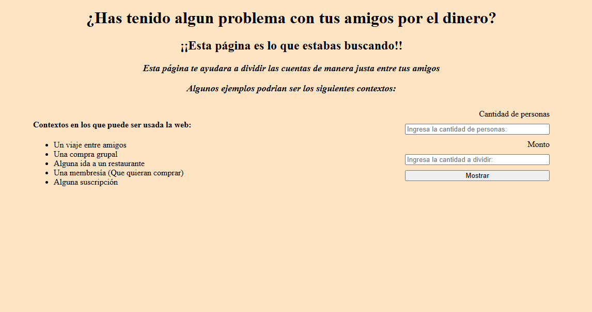
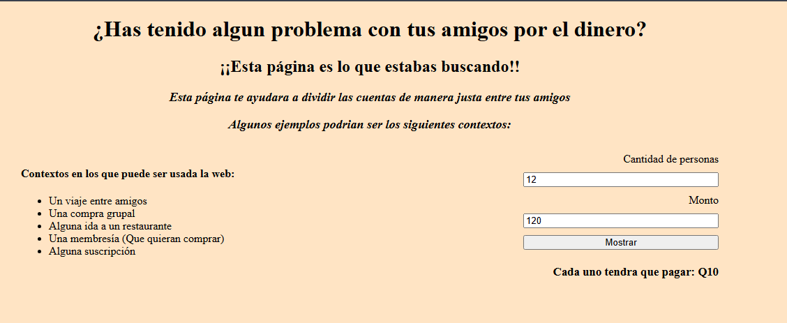
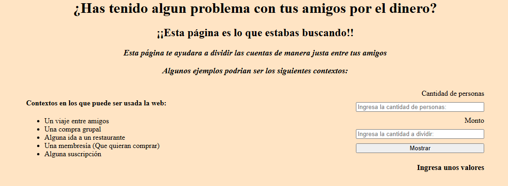
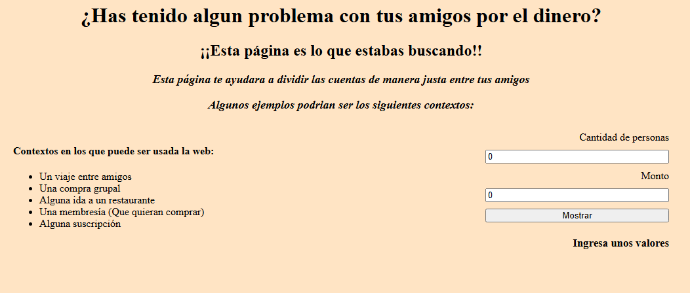
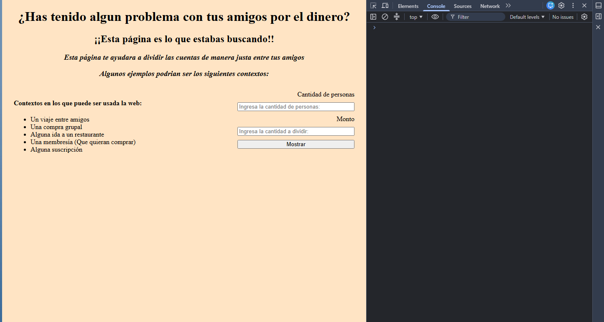
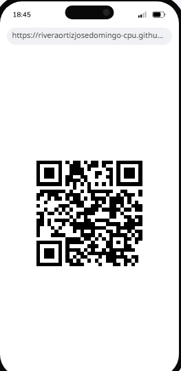

# Dia 20
## Guion
Amigos y problemas entre cuentas

Imagina que terminaste de cenar con cinco amigos. Llega la cuenta, incluye propina, consumos desiguales y alguien pagó con tarjeta. Empieza el momento incómodo de calcular en la calculadora del teléfono cuánto debe transferir cada uno.

Observamos que el usuario se puede llegar a frustrar al no resolver el problema.

**El Producto en Acción:**

 Al ingresar a la aplicación, [Organizador de cuentas] realiza un calculo para dividir las cuentas equitativamente, transformando el problema en un Resultado positivo.

En las pruebas de usuario descubrimos que el programa puede tener bugs. En la versión v1.1.0 escalaremos para corregir ciertos errores que se presenten.

Durante el proceso descarte muchas opciones de ideas de otras paginas web, lo cual aun no me siento capacitado para realizar.

Lo que aprendi es que por mas sencillo que se vea un programa / Pagina puede llevar mucho tiempo detras, y sobre todo una visíon a futuro que tengo es realizar programas mas complejos
#### Uno de los errores que pude encontrar es que no aproxima los decimales del resultado.
## Preguntas
1. ¿Como funciona la pagina web? = Funciona con una estructura de HTML y los botones funcionan mediante una conexión con el lenguaje de JS (JavaScript).
2. ¿Que pasa si se ingresa 0 en el campo? = La pagina web mostrara un mensaje de que el usuario ingrese valores validos.
3. ¿Que pasa si un campo se deja en vacío? = Pasara lo mismo que si solamente se ingresan ceros, mostrara un mensaje pidiendo información valida.
4. ¿Cual fue la principal estructura del codigo en JS? = Prioriza el uso de condicionales para saber que texto mostar y mediante una operación aritmetica saber cuanto es individualmente
5. ¿Como se puede decorar la página? = Usando el famoso lenguaje llamado CSS, este nos permite cambiar margenes, tamaño de letra, tipo de letra etc.

## URL
https://riveraortizjosedomingo-cpu.github.io/Dia-20/
## Capturas del proyecto

## consola limpia 

## Codigo QR
