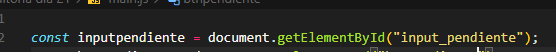
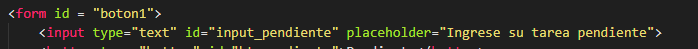

# Día 21
## Presentación del programa
He observado que varios estudiantes tienen dificultades para llevar un control de tareas, entonces he decidido crear una pagina web. Incentivando a los estudiantes que tengan un buen orden con sus actividades universitarias o escolares.

## Antes de comenzar...
### ¿ Por que decidi hacerlo?
Considero que la programación y el desarrollo web son muy utiles en la vida cotidiana , asi como esa pagina me puede servir a mi, le puede servir a muchas personas.

## Relato
Durante la fase de prueba, detecte que habia un problema en la estructura html, hay dos columnas (una de pendiente y la otra de completada) input y botones . ¿cual era el problema? para definir la funcion de boton se debe escribir type "button", lo que paso fue que en vez de estar escrito como "type" estaba escrito como "typé" con una tilde, esto arruina la sintaxis y hace que no funcione los botones. Para corregirlo solamente se cambia de manera correcta type.

## Evidencia
Al analizar el funcionamiento del programa, hubo un error de logica en el codigo de java script, en el momento de identificar los contenedores ya que en el codigo de js salen de manera distinta que en html. Por ejemplo: un input con id = "inputpendiente" en html y en js de esta manera = const inputpen = document.getElementaryById("inputpendientes"); . Esta escrito de manera distinta ya que contiene una "s" de más.

## Iteración
A partir de esta hallzago se realizo una prueba para mejorar el funcionamiento del programa, el cual se espera que lo haga funcionar. Se espera que este cambie y funcione de manera correcta colocando cada lista donde debe ir con sus respectivos botones.

## Resultado
Esos cambios permitieron que el programa funcionara de manera correcta y eficiente.
